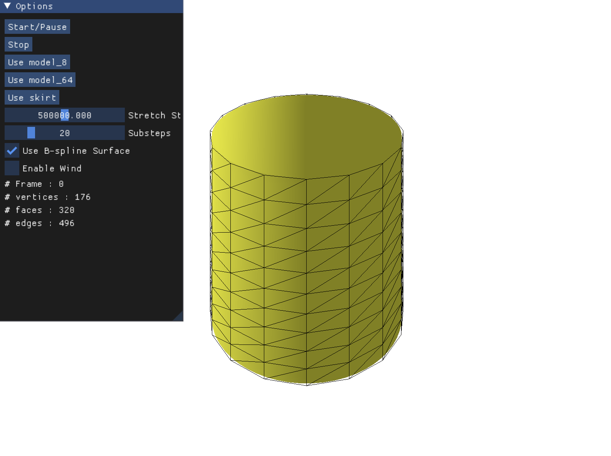

# 🧵 Real-Time Cloth Simulation using XPBD and B-spline Surface

## 💡 Overview

This project implements a **real-time cloth simulation** using **XPBD (eXtended Position-Based Dynamics)** and enhances its visual quality through **B-spline surface reconstruction**. It was developed as a course project for **CPSC 589: Modeling for Computer Graphics** at the University of Calgary.

By simulating a **low-resolution mesh** and rendering a **high-resolution B-spline surface**, this project achieves **visually pleasing results** with **low computational cost**.

---

## ✨ Key Features

- **Low-resolution cloth simulation with XPBD**
  - Fast and stable dynamics
- **High-resolution rendering via B-spline**
  - Smooth and detailed visuals without heavy computation
- **Real-time UI (ImGui)**
  - Toggle B-spline rendering
  - Adjust stiffness values and number of substeps
  - Switch between `plane_8`, `plane_64`, and `skirt` models
  - Enable/disable wind
- **Vertex selection & fixing**
  - Interactive vertex selection using the mouse
- **Procedural wind simulation**
  - Randomized, turbulent wind with directional control

---

## 🛠️ Requirements

- Python 3.8+
- Taichi
- NumPy
- TriMesh

## 🎮 Controls

### 🖱️ Mouse

| Action               | Key/Button         | Description                              |
|----------------------|--------------------|------------------------------------------|
| Select vertices      | Left Click (LMB)   | Select vertices by clicking or dragging  |
| Rotate camera        | Right Click (RMB)  | Rotate the camera using virtual trackball |

---

### ⌨️ Keyboard

| Key             | Action                                      |
|------------------|----------------------------------------------|
| `f`              | Fix selected vertices                        |
| `r`              | Reset all fixed vertices                     |
| `↑` (Up arrow)   | Zoom in                                      |
| `↓` (Down arrow) | Zoom out                                     |

---

### 🧩 GUI (ImGui Options)

| Option                 | Description                                        |
|------------------------|----------------------------------------------------|
| `Start/Pause`          | Toggle simulation running state                    |
| `Stop`                 | Stop and reset the simulation                      |
| `Use model_8`          | Switch to low-resolution cloth mesh                |
| `Use model_64`         | Switch to high-resolution cloth mesh               |
| `Use skirt`            | Switch to cylindrical skirt cloth mesh             |
| `Stretch Stiffness`    | Adjust the stiffness of stretch constraints        |
| `Bending Stiffness`    | Adjust the stiffness of bending constraints        |
| `Substeps`             | Number of substeps for constraint solver           |
| `Use B-spline Surface` | Toggle between raw mesh or smooth B-spline surface |
| `Enable Wind`          | Enable or disable wind force                       |
